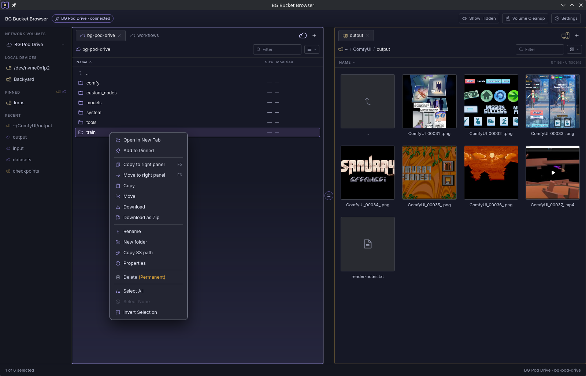

# BG Bucket Browser

Version 1.1.1

Created by Bulent Gercek

BG Bucket Browser is a desktop file manager for RunPod network volumes. It
shows a RunPod volume (accessed through its S3-compatible API) and the local
disk side by side, and moves files between them without requiring a running
pod.



## Motivation

RunPod network volumes are only reachable through a pod's shell or through
the S3 API. Managing files without paying for GPU time means either running
a low-cost CPU pod for shell access, or scripting S3 calls by hand. This
application replaces both with a direct, always-available file manager.

## Features

- Dual-pane layout: a RunPod volume on one side, the local filesystem on the
  other. Either pane can hold either source.
- Multiple named volume connections, switchable from the sidebar.
- File transfer in all four directions (local-to-local, local-to-remote,
  remote-to-local, remote-to-remote), including folders. `F5` copies the
  active pane's selection to the other pane, `F6` moves it.
- Resumable downloads and resumable multipart uploads. An interrupted
  transfer continues from where it stopped instead of restarting.
- Drag and drop between panes, tabs, pinned locations, and a recent-paths
  list, on all three platforms. Dragging files in from the OS file manager
  (Explorer, Finder, Dolphin/Nautilus) works on Linux; on Windows and macOS
  it is disabled by a WebView limitation shared by both platforms (the
  in-pane drag-and-drop and the native OS-drop handler can't both be active
  at once — in-pane was kept, since it covers more everyday use). Use the
  pane's own navigation plus in-app drag, or `F5`/`F6`, instead.
- Copy, cut, and paste that interoperate with the desktop file manager's own
  clipboard. Verified on Linux (KDE Plasma and GNOME, including proper
  cut/move semantics on Wayland), on Windows with Explorer, and on macOS with
  Finder.
- Image and video thumbnails, generated from partial (ranged) reads so large
  remote files are not downloaded in full just to preview them.
- A volume cleanup screen: scans a remote volume's object listing, reports
  the largest objects and reclaimable patterns (`__pycache__`, `.pyc`,
  `.ipynb_checkpoints`, zero-byte files), and deletes selected objects.
- Total volume capacity shown in the status bar, read from the RunPod
  account API.
- Credentials stored in the operating system's native credential store —
  Secret Service (KWallet or GNOME Keyring) on Linux, Credential Manager on
  Windows, Keychain on macOS — never written to disk in plain text.
- "Open in BG Bucket Browser" integration with the OS file manager, opening
  a local folder directly in the app. A Settings toggle registers/unregisters
  it at runtime: a right-click menu entry on a folder in Dolphin/Nautilus
  (Linux, via a `.desktop` file) and in Explorer (Windows, via a
  per-user registry key), or a Finder Services menu item (macOS). Packaged
  installers (`.deb`, NSIS, MSI) also clean up their own registration on
  uninstall; an AppImage has no install/uninstall step, so switching the
  toggle off before deleting it is the only way to remove the registration.
- In-app feedback (Settings → Feedback): write a message and send it with one
  press, with no email client or GitHub account needed. **Record the problem**
  captures a detailed log for up to five minutes while you reproduce an issue;
  it is attached in its own read-only box, so you see exactly what will be
  sent. A recording cut short by a crash is offered again on the next start.
- Light, dark, and system theme.

## Non-goals

The application does not list, start, or stop RunPod pods, and does not
open an SSH session. It manages files on a volume; it does not manage
compute.

## Platform support

Built with Tauri. All three of its desktop targets — Linux, Windows, and
macOS — have been built, packaged, and smoke-tested end to end: connecting
to a volume, browsing both panes, transferring files, and the native
packaging format for each platform. The one platform-specific behavior is
the OS-drag-in limitation on Windows/macOS noted under Features; everything
else works the same way on all three.

| Platform | Package formats       |
| -------- | --------------------- |
| Linux    | AppImage, `.deb`      |
| Windows  | `.msi`, NSIS (`.exe`) |
| macOS    | `.dmg`                |

## Requirements

- A RunPod account with a network volume and an S3-compatible access
  key/secret pair for that volume.
- Optionally, a RunPod account API key (read-only is sufficient) to display
  the volume's total capacity.
- **Linux:** a Secret Service-compatible credential store (KWallet or GNOME
  Keyring; present by default on KDE Plasma and GNOME).
- **Windows:** Windows 10/11 with WebView2 (preinstalled on current
  Windows; Tauri prompts to install it otherwise).
- **macOS:** no extra runtime requirement; Keychain is built in.

## Installing

Prebuilt packages are published with each release on the
[Releases](https://github.com/bulentgercek/bg-bucket-browser/releases) page.

**Linux:** no prebuilt package. A build made on your own system links against
its own libraries, so it runs there without compatibility issues — see
Building from source.

**Windows:** two packages, both 64-bit:

- `BG-Bucket-Browser_<version>_x64-setup.exe` installs for the current user
  and does not ask for administrator rights.
- `BG-Bucket-Browser_<version>_x64_en-US.msi` installs for all users and
  needs administrator rights.

Neither is signed, so SmartScreen warns on the first run: choose More info,
then Run anyway.

**macOS:** download `BG-Bucket-Browser_<version>_x64.dmg`, open it and drag the
app to Applications. It is not signed or notarized, so macOS blocks the first
launch. Open the app once, then go to System Settings → Privacy & Security and
choose Open Anyway. Or clear the quarantine flag from Terminal:

```
xattr -dr com.apple.quarantine "/Applications/BG Bucket Browser.app"
```

The package is built for Intel (x64) and runs on Apple Silicon through
Rosetta 2.

## Building from source

Build on the machine you want to run it on: Tauri's native dependencies
(`aws-lc-sys`, WebView bindings) do not cross-compile between operating
systems, so a Linux build cannot produce a Windows or macOS package and vice
versa. This is also how to get a Windows or macOS build of your own instead of
the published package.

### 1. Prerequisites

Every platform needs Rust, installed with [rustup](https://rustup.rs), and
Node.js, from [nodejs.org](https://nodejs.org). On top of that:

- **Linux:** a C toolchain and the WebKitGTK and D-Bus development files
  (Debian/Ubuntu package names):

  ```
  sudo apt install build-essential pkg-config libwebkit2gtk-4.1-dev libdbus-1-dev
  ```

- **Windows:** the MSVC build tools, installed via rustup or Visual Studio.
- **macOS:** Xcode Command Line Tools: `xcode-select --install`

### 2. Get the source

```
git clone https://github.com/bulentgercek/bg-bucket-browser.git
cd bg-bucket-browser
npm install
```

### 3. Build

**Linux:**

```
NO_STRIP=1 npx tauri build --bundles appimage,deb
```

`NO_STRIP=1` avoids a build failure on distributions with a glibc/binutils
newer than the bundling tool's embedded `strip` binary (Arch/CachyOS,
Fedora 39+, Ubuntu 24.04+). Runtime dependencies on Debian-based systems
(`libwebkit2gtk-4.1-0`, `libgtk-3-0`, `libdbus-1-3`) are installed
automatically with the `.deb` package.

**Windows:**

```
npx tauri build --bundles msi,nsis
```

**macOS:**

```
npx tauri build --bundles dmg
```

Every platform writes its output to `src-tauri/target/release/bundle/`.

## Development

```
npm install
npx tauri dev
```

On Linux, `./dev` is available as a shortcut — a thin wrapper that avoids an
npm exit-code quirk in some shells (see the script for details); it is
equivalent to `npx tauri dev` and not required.

Rust code changes require restarting the dev command; frontend changes
hot-reload.

Toolchain used during development: Rust 1.98, Node.js 26.

### Tests

```
npm test
cd src-tauri && cargo test
```

Neither needs network access or credentials: S3 requests are intercepted and
Tauri commands are mocked.

### Debug logging

The application keeps a development log of its own, in two files, wherever the
operating system puts application logs (a third one exists only while a
feedback recording runs, see below):

- Linux: `~/.local/share/com.bulentgercek.bgbucketbrowser/logs/`
- Windows: `%LOCALAPPDATA%\com.bulentgercek.bgbucketbrowser\logs\`
- macOS: `~/Library/Logs/com.bulentgercek.bgbucketbrowser/`

`toast.log` records every notification the interface shows, one line each. It
is always written: each launch starts a new file and keeps the previous one as
`toast.log.1`. `verbose.log` records the commands the interface called and the
internal detail around them, and rotates to `verbose.log.1` past 5 MB. Both
open with a `=== session ... ===` line and close with `=== session end ... ===`
when the application exits normally, so a missing end line means it was killed
or crashed.

`verbose.log` is off in a build made from a release checkout and on in a
development one. `BGBB_LOG=verbose` turns it on, `BGBB_LOG=quiet` turns it off.
Neither file is configurable from the interface, neither is sent anywhere, and
credentials are never written to either.

While you record a problem from Settings → Feedback, the same detail is also
written to `recording.log` in that folder, whatever the verbose setting is.
It contains file names and paths, but no credentials. It leaves your computer
only when you press **Send**: the report goes over HTTPS to
`https://bulentgercek.com/feedback`, which forwards it to the developer by
email and deletes its copy 30 days after delivery. The file is deleted once the report is
accepted, or when you remove the recording. A build made from a development
checkout sends to the service's test channel, where nothing is stored or
delivered.

## Architecture

The application core is written in Rust (`src-tauri/`) and handles S3
communication, local filesystem access, credential storage, and file
transfer. The interface is React and TypeScript (`src/`), rendered in the
operating system's native webview. The two communicate through Tauri's
command and event system; no Node.js runtime is embedded.

Most platform differences (drag-and-drop behavior, the "Open in BG Bucket
Browser" registration mechanism, keychain backend) live behind a single
Rust API and a few `cfg(target_os = ...)`-gated modules and per-platform
Tauri config overrides (`tauri.windows.conf.json`, `tauri.macos.conf.json`);
the frontend does not need to know which OS it is running on.

## Support

If the application is useful to you, you can support its development through
[GitHub Sponsors](https://github.com/sponsors/bulentgercek). Sponsorship would
go first toward code signing for the macOS and Windows packages.

## License

Apache License 2.0. See [LICENSE](LICENSE). Modified copies must retain the
original copyright notice and mark what was changed.
